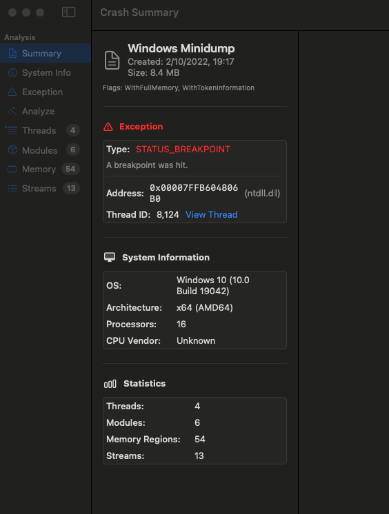
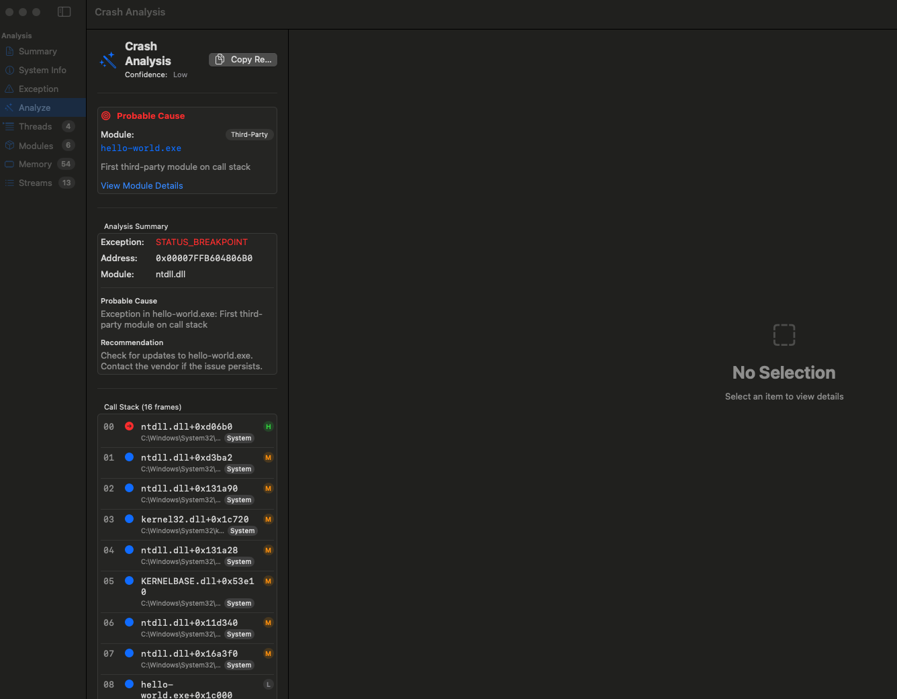
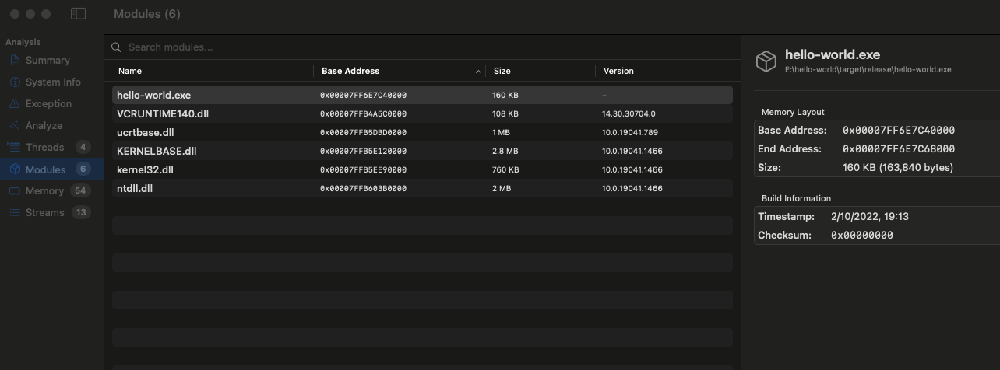
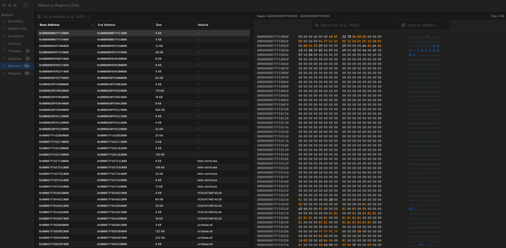

# MiniDumpTruck

A native macOS application for analyzing Windows crash dump files (.dmp). Get WinDbg-like crash analysis without needing Windows.



## Features

- **Native macOS Experience** - Built with SwiftUI, feels right at home on your Mac
- **WinDbg-style Crash Analysis** - Automatic blame detection, call stack walking, and actionable recommendations
- **Full Minidump Parsing** - Threads, modules, memory regions, exception records, system info, and more
- **Memory Inspector** - Hex view with address navigation for examining raw memory
- **No Windows Required** - Analyze customer crash dumps directly on macOS

## Screenshots

### Crash Analysis
Automatic crash analysis identifies the probable cause, faulting module, and provides recommendations.



### Module Inspector
View loaded modules with base addresses, sizes, versions, and memory layout details.



### Memory Hex View
Examine raw memory regions with hex dump and ASCII representation.



## Installation

### Building from Source

```bash
cd App && swift build -c release
```

The built application will be at `App/.build/release/MiniDumpTruck`.

### Opening in Xcode

```bash
open App/Package.swift
```

Build and run with Cmd+R to get a proper .app bundle.

## Usage

1. Launch MiniDumpTruck
2. Open a `.dmp` file (File > Open or drag and drop)
3. Navigate the sidebar to explore different streams:
   - **Summary** - Overview with exception and system info
   - **Analyze** - WinDbg-like !analyze output
   - **Exception** - Exception code and faulting address
   - **Threads** - Thread list with register state
   - **Modules** - Loaded DLLs and executables
   - **Memory** - Memory regions with hex inspection
   - **System Info** - OS version, processor info

## Supported Minidump Streams

| Stream | Description |
|--------|-------------|
| ThreadList | Thread IDs and context (registers) |
| ModuleList | Loaded modules with version info |
| Exception | Exception record and context |
| SystemInfo | OS version and processor architecture |
| Memory64List | Full memory dump regions |
| MiscInfo | Process times and other metadata |
| HandleData | Open handles |

## Requirements

- macOS 14.0 (Sonoma) or later
- Apple Silicon or Intel Mac

## Technical Details

MiniDumpTruck parses the Windows Minidump format directly:
- Header signature: `MDMP` (0x504D444D)
- Little-endian binary format
- Stream-based architecture with directory at header-specified offset
- x64 CONTEXT structure support for register state

## License

MIT
