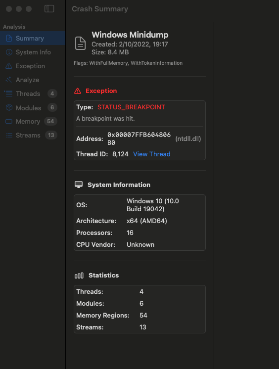
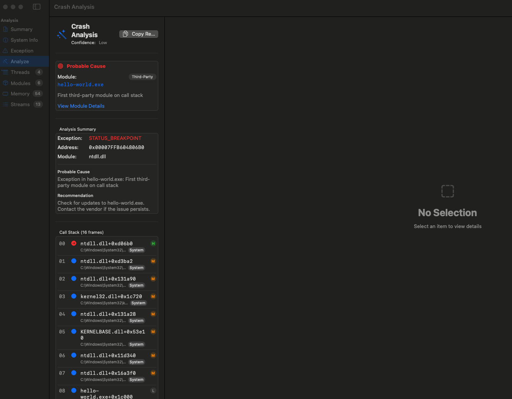
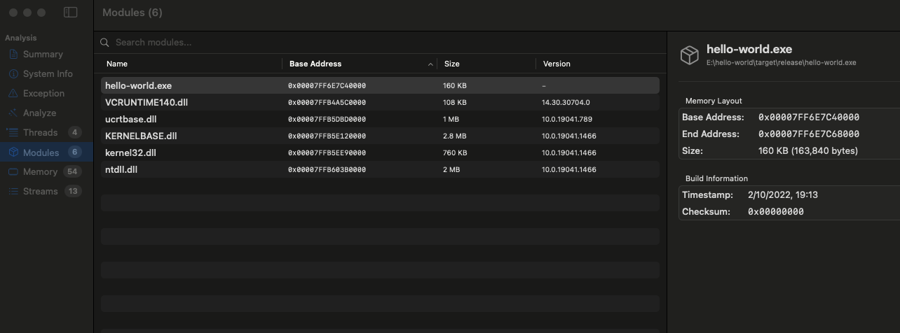
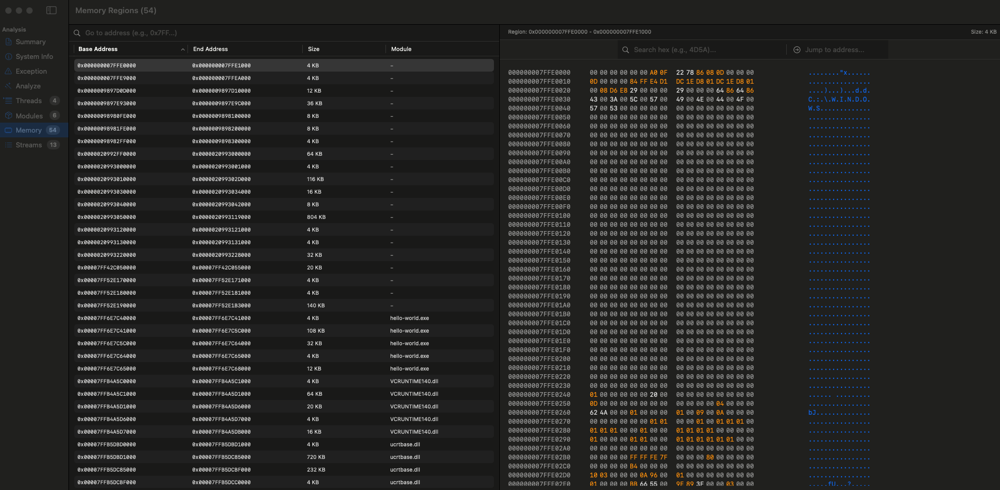

# MiniDumpTruck

[](https://github.com/jloutsch/minidumptruck/actions/workflows/ci.yml)

A native macOS application — and companion CLI — for analyzing Windows crash dump files (`.dmp`). Get WinDbg-style crash analysis without needing Windows or WinDbg.



## Why

Analyzing Windows crash dumps on macOS has traditionally meant wrestling with Google Breakpad's command-line tools or spinning up a Windows VM. MiniDumpTruck parses the Windows minidump format directly and presents the result in a native UI, with a CLI for batch and CI use.

## What it does

**Desktop app** (SwiftUI, macOS 14+)
- Opens `.dmp`, `.mdmp`, `.minidump`, and `.zip` files via drag-drop, the Open panel, or Finder double-click
- Sidebar navigation across Summary, System Info, Misc Info, Exception, Analyze, Threads, Modules, Handles, Memory, and Streams
- Automated crash analysis with blame attribution, probable cause, and recommendation — one-click **Copy Verdict** writes the lot to the clipboard for pasting into a ticket
- Hex memory inspector with address search and navigation
- In-app **Help** window (`⌘?`) covering the sidebar, keyboard shortcuts, and CLI reference

**Crash analysis**
- x64 table-based stack unwinding via the module's `.pdata` / `.xdata` (the same mechanism WinDbg's `k` uses on optimized release builds with no frame pointer)
- ARM64 (AAPCS64) frame-record chain walking
- RBP-chain fallback for x64 frame-pointer builds, plus a heuristic stack scan for the long tail
- Optional **PDB symbolication** via the Microsoft public symbol server — frames render as `module!function+0xNN` instead of `module+0xNN` when symbols are available

**Command-line tool** (`minidumptruck-cli`) — see [Usage → CLI](#usage--cli) below
- `analyze` — interactive analysis report; batch mode over a directory
- `export` — write reports as text, HTML, CSV, or JSON
- `info` — quick triage summary
- Documented exit codes so CI / scripts can branch on "no crash" vs "crash detected" vs "parse failure"

## Screenshots

### Crash Analysis
Automatic crash analysis identifies the probable cause, faulting module, and provides recommendations.



### Module Inspector
View loaded modules with base addresses, sizes, versions, and memory layout details.



### Memory Hex View
Examine raw memory regions with hex dump and ASCII representation.



## Installation

### Pre-built DMG (recommended)

Download the latest `MiniDumpTruck-<version>-arm64.dmg` from the [Releases](https://github.com/jloutsch/minidumptruck/releases) page, open it, and drag the app to `Applications`.

The DMG is ad-hoc signed (not notarized — yet). On first launch macOS Gatekeeper will refuse to open it; right-click the app → **Open**, then confirm. After that one-time bypass the app launches normally.

Apple Silicon only at the moment. Intel users should build from source.

### Build from source

Requirements: macOS 14 (Sonoma) or later, Swift 5.9+.

```bash
cd App
swift build -c release             # produces App/.build/release/MiniDumpTruck
swift build -c release --product minidumptruck-cli
```

To produce a real `.app` bundle + DMG locally (matches what GitHub Actions ships):

```bash
scripts/build-app.sh 0.0.0-local
```

Output lands in `build/release/`.

To open in Xcode:

```bash
open App/Package.swift
```

## Usage — Desktop app

1. Launch MiniDumpTruck
2. Open a `.dmp` file (drag-drop, **File → Open**, double-click in Finder, or `open file.dmp` from a terminal)
3. The sidebar lists every stream present in the dump. Useful starting points:
   - **Summary** — top-level overview with the exception, blamed module, and a Copy Verdict button
   - **Analyze** — full WinDbg-style `!analyze` output: walked call stack, confidence indicators, copyable per-frame
   - **Threads** — every thread with its register state; the faulting thread is highlighted
   - **Modules** — loaded DLLs, base addresses, versions, checksums
   - **Memory** — captured memory regions, hex viewer with address search

Keyboard shortcuts: `⌘G` Go to Address, `⇧⌘E` Export HTML, `⇧⌘S` Export CSV, `⌘?` Help.

## Usage — CLI

```
USAGE: minidumptruck-cli <subcommand>

SUBCOMMANDS:
  analyze (default)       Analyze crash dump file(s) and print a report.
  export                  Export crash dump data in various formats.
  info                    Show quick summary of a crash dump.
```

### Examples

```bash
# Single dump
minidumptruck-cli analyze crash.dmp

# Verbose (includes register state + memory regions)
minidumptruck-cli analyze crash.dmp --verbose

# Batch over a directory (4-way concurrent by default)
minidumptruck-cli analyze ./dumps/ --jobs 8

# Summary only — skip per-file reports, print aggregate counts
minidumptruck-cli analyze ./dumps/ --summary

# Export every dump in a directory as HTML
minidumptruck-cli export ./dumps/ --format html --output ./reports/

# Single dump to JSON (useful piped into jq for CI assertions)
minidumptruck-cli export crash.dmp --format json --output ./out/

# Quick triage — just the dump header + system info + exception
minidumptruck-cli info crash.dmp

# Full manual
minidumptruck-cli help
```

### Exit codes

| Code | Meaning |
|------|---------|
| 0 | Success, no crash exception present |
| 1 | File not found / argument-parsing error |
| 2 | Crash detected (exception parsed successfully) |
| 3 | Parse failure, IO error, or file exceeded `--max-file-size` |

## Supported minidump streams

| Stream | Description |
|--------|-------------|
| ThreadList | Thread IDs, stack range, context (registers) |
| ModuleList | Loaded modules with paths, sizes, versions, CodeView records (PDB GUID + age) |
| Memory64List | Full memory dump regions |
| MemoryList | Standard (non-`Memory64`) memory regions |
| MemoryInfoList | Virtual-memory protection / state per region |
| Exception | Exception record with parameter decoding (ACCESS_VIOLATION etc.) |
| SystemInfo | OS version, processor architecture, CSD version |
| MiscInfo | Process times, identifiers, and additional metadata (versions 1–5) |
| HandleData | Open kernel object handles with type / name resolution |
| UnloadedModuleList | DLLs unloaded before the crash (enables use-after-unload detection) |
| ThreadNameList | Thread names where the producer set them |

## Requirements

- macOS 14.0 (Sonoma) or later
- Pre-built DMG: Apple Silicon (arm64)
- Build from source: Apple Silicon or Intel

## Technical details

- Header signature: `MDMP` (`0x504D444D`); little-endian throughout
- Stream-based architecture: the header points at a directory of `(stream type, RVA, size)` entries, each parsed independently
- Memory access is on-demand — memory regions stay in the original file at their RVA and are read only when needed, so multi-GB full-memory dumps don't have to be loaded into Swift heap
- Stack walking architecture:
  - x64: table-based unwinding via `.pdata` + `.xdata` (binary-searched per frame), then RBP-chain, then heuristic scan
  - ARM64: AAPCS64 frame-record chain at `[FP]` / `[FP+8]`, then heuristic scan
  - Cross-architecture seen-address dedup; each frame is tagged with its confidence (high / medium / low)
- Symbolication: Microsoft public symbol server fetch + a Swift PDB / MSF parser (subset — enough to resolve public symbols for `module!function+offset` rendering)
- Swift Package layout: `MiniDumpTruckCore` library (parser + models + services), `MiniDumpTruck` executable (SwiftUI app), `minidumptruck-cli` executable

The project has 846 tests across 117 suites. Run `swift test` from `App/` to execute them.

## License

[GNU GPLv3](LICENSE)
